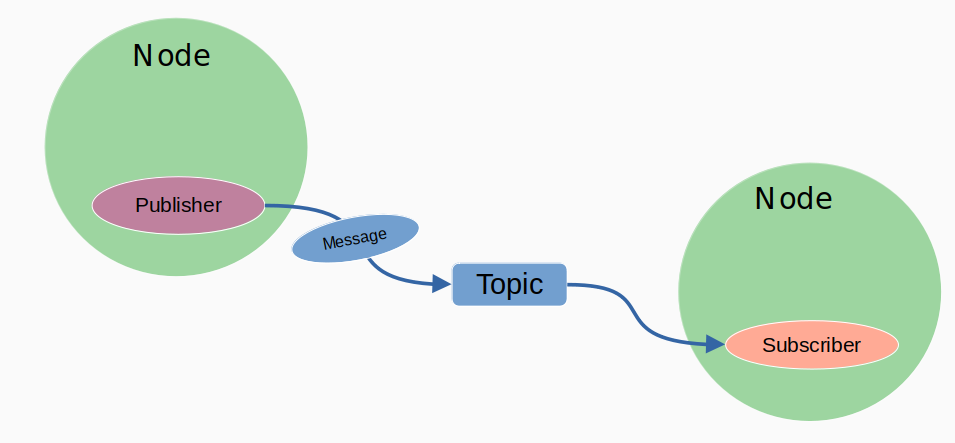
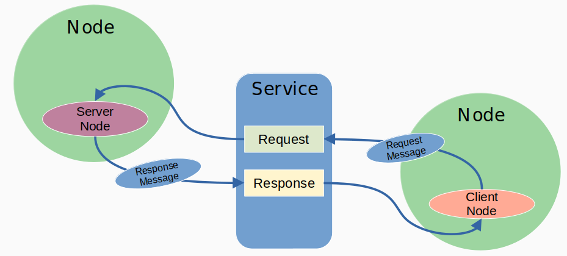
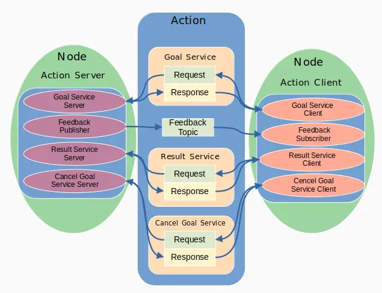
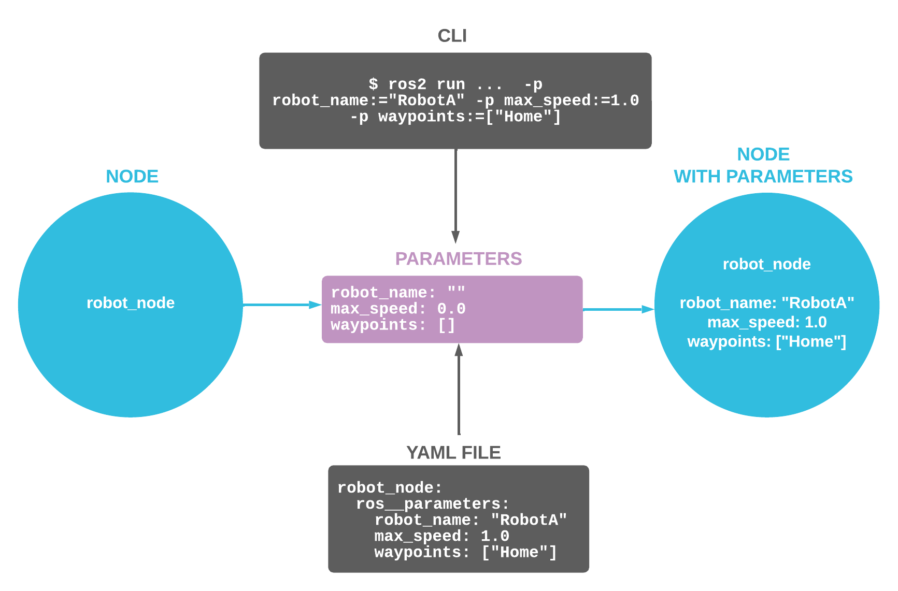

# ROS2 Notes

### Executables from packages (built with colcon)

1.  Install a well known pacakge, e.g., turtlesim

```shell
sudo apt update
sudo apt install ros-jazzy-turtlesim
```

2.  See list of packages

```shell
ros2 pkg list
```

3.  See list of executables

```shell
ros2 pkg executables
```

4.  See list of executables in a specific package

```shell
ros2 pkg executables turtlesim
```

5. Where is turtlesim package?

```shell
cd $(ros2 pkg prefix turtlesim)
code .
Ctrl+P -> trurtlesim
```

6. Run an executable from a package

```shell
ros2 run <package_name> <executable_name>
```

e.g:

```shell
ros2 run turtlesim turtlesim_node
```

### Nodes

1. See ros2 node help

```shell
ros2 node --help
```

2. See list of current nodes

```shell
# run a node first
ros2 run <package_name> <executable_name>
ros2 node list
```

3. See info about a node

```shell
ros2 node info /<node_name>
```

### Communication (Topics)



1. First, run a node that publishes topics

```shell
ros2 run turtlesim turtlesim_node
```

2. See ros2 topic help

```shell
ros2 topic --help
```

3. See list of current topics

```shell
ros2 topic list

# see topic details with types
ros2 topic list -t

# see topic details with publishers and subscribers
ros2 topic list -v
```

4. See a graphical representation of topics

```shell
rqt_graph
```

5. Echo messages from a topic

```shell
ros2 topic echo /<topic_name>

# e.g., (check with turtle_teleop_key node after running this command)
ros2 topic echo /turtle1/cmd_vel
```

6. See info about a topic

```shell
ros2 topic info /<topic_name>
```

7. See info about a `topic type` (`type` is the message type used by the topic)

```shell
ros2 topic type /<topic_name>

# Show the message definition
ros2  interface show <type_name>

# e.g.,
ros2 interface show geometry_msgs/msg/Twist
```

8. Publish messages to a topic

```shell
ros2 topic pub /<topic_name> <type_name> '{<field1>: <value1>, <field2>: <value2>, ...}'

# e.g., (move turtle1)
ros2 topic pub /turtle1/cmd_vel geometry_msgs/msg/Twist '{linear: {x: 2.0, y: 0.0, z: 0.0}, angular: {x: 0.0, y: 0.0, z: 1.8}}'
```

9 . Publish messages to a topic at a specific rate

```shell
ros2 topic pub -r <rate_in_Hz> /<topic_name> <type_name> '{<field1>: <value1>, <field2>: <value2>, ...}'

# e.g., (move turtle1 at 1 Hz)
ros2 topic pub -r 1 /turtle1/cmd_vel geometry_msgs/msg/Twist '{linear: {x: 2.0, y: 0.0, z: 0.0}, angular: {x: 0.0, y: 0.0, z: 1.8}}'
```

10. Check the pose of the turtle by echoing the `/turtle1/pose` topic

```shell
ros2 topic echo /turtle1/pose

# show average rate of messages being published to a topic
ros2 topic hz /turtle1/pose
```

### Communication (Services)



1. See ros2 service help

```shell
ros2 service --help
```

2. See list of current services

```shell
ros2 service list

# see service details with types
ros2 service list -t
```

3. See info about a service

```shell
ros2 service info /<service_name>
```

4. See info about a service type

```shell
ros2 service type /<service_name>

# e.g.,
ros2 service type /clear
```

5. We can also find service with serivce type

```shell
ros2 service find <service_type>

# e.g.,
ros2 service find std_srvs/srv/Empty
```

6. We can see the service definition with

```shell
ros2 interface show <service_type>

# e.g.,
ros2 interface show std_srvs/srv/Empty
```

7. Call a service

```shell
ros2 service call /<service_name> <service_type> '{<request_field1>: <value1>, <request_field2>: <value2>, ...}'

# e.g., (clear the turtlesim background)
ros2 service call /clear std_srvs/srv/Empty '{}'

e.g., (spawn a new turtle at x=5.0, y=5.0, theta=0.0)
ros2 service call /spawn turtlesim/srv/Spawn '{x: 2.0, y: 3.0, theta: 0.0, name: "turtle2"}'
```

### Communication (Actions)



1. See ros2 action help

```shell
ros2 action --help
```

2. See list of current actions

```shell
ros2 action list
```

3. Run a turtle_teleop_key node to control the turtle with keyboard

```shell
ros2 run turtlesim turtle_teleop_key
```

- Now we can try a action with `G` key to make the turtle go to a specific location
- To cancel the action, press `F` key
- Check the status of the action in another terminal

4. See all action servers from current nodes

```shell
ros2 action list

# list with types
ros2 action list -t

# list with types, servers and clients
ros2 action list -v
```

4. See the action clients in a node

```shell
ros2 node info </node_name>

# e.g.,
ros2 node info /teleop_turtle
```

5. See info about an action

```shell
ros2 action info /<action_name>

# e.g.,
ros2 action info /turtle1/rotate_absolute
```

6. Check the action data type

```shell
ros2 interface show <action_type>

# e.g.,
ros2 interface show turtlesim/action/RotateAbsolute
```

7. Send a goal to an action server

```shell
ros2 action send_goal /<action_name> <action_type> '{<goal_field1>: <value1>, <goal_field2>: <value2>, ...}'

# e.g.,
ros2 action send_goal /turtle1/rotate_absolute turtlesim/action/RotateAbsolute '{theta: 1.57, max_rotation_speed: 1.0}'
```

### Parameters



1. See ros2 param help

```shell
ros2 param --help
```

2. See list of parameters for a node

```shell
ros2 param list /<node_name>

# e.g.,
ros2 param list /turtlesim
```

3. Get parameter value

```shell
ros2 param get /<node_name> <parameter_name>

# e.g.,
ros2 param get /turtlesim background_g
```

4. Dump all parameters for a node

```shell
ros2 param dump /<node_name>

# e.g.,
ros2 param dump /turtlesim
```

5. Dump to a `.yaml` file

```shell
ros2 param dump /<node_name> > <file_name>.yaml

# e.g.,
ros2 param dump /turtlesim > turtlesim_params.yaml
```

6. Set a parameter value

```shell
ros2 param set /<node_name> <parameter_name> <new_value>

# e.g.,
ros2 param set /turtlesim background_g 100
```

7. Load parameters from a `.yaml` file

```shell
ros2 param load /<node_name> <file_name>.yaml

# e.g.,
ros2 param load /turtlesim turtlesim_params.yaml
```

### Workspaces and Building Packages

1. A Workspace folder structure

```
<workspace_name>/
 ├── build/ (generated after build)
 ├── install/ (generated after build)
 ├── log/ (generated after build)
 └── src/
    ├── my_cpp_pkg/
    │   ├── CMakeLists.txt
    │   ├── package.xml
    │   ├── include/
    │   ├── src/
    │   ├── launch/
    │   └── config/
    ├── my_py_pkg/
    │   ├── package.xml
    │   ├── setup.py
    │   ├── resource/
    │   ├── my_py_pkg/
    │   ├── launch/
    │   └── config/
    ├── README.md
    └── workspace.repos
```

2. Create a workspace

```shell
mkdir -p ~/ros2_ws/src
cd ~/ros2_ws/
```

3. Install colcon build tool

```shell
sudo apt install python3-colcon-common-extensions
```

4. Add some source code to test build

```shell
mkdir -p src/examples
git clone https://github.com/ros2/examples.git src/examples
```


